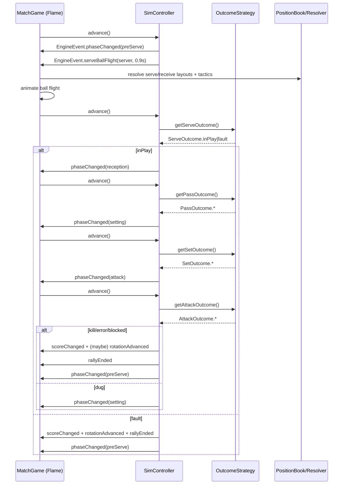

# Volleyball Manager — Match Simulation Architecture & Flow

> A single-page technical guide to how rallies are simulated, how players are placed on court, how serve–receive tactics override positions, and how the UI wires into the engine.  
> Copy this file into your repo as: `docs/match_flow.md` (or anywhere you prefer).

---

## TL;DR

- **`SimController`** advances the rally state machine and emits **`EngineEvent`s**.  
- **`OutcomeStrategy`** decides probabilistic outcomes (serve → pass → set → attack).  
- **`PositionBook` + `PositionResolver`** turn JSON layouts into absolute positions.  
- **`TacticsProvider`** holds per-rotation serve–receive specs (2/3/4 passers & combos).  
- **Planners** (`ServeReceivePlanner`, `ServeTargetPlanner`) use tactics + anchors to place passers and pick serve targets.  
- **`MatchGame`** renders the court/players, listens for events, and animates serves.  
- **`MatchPage`** gates rendering until positions are loaded, so the game starts stable.

---

## Rally Lifecycle (High-Level)

1. **preServe** → engine schedules a serve ball-flight event.  
2. **serve** → outcome decided (in-play or fault).  
3. **reception** → pass outcome (perfect/average/single/overpass).  
4. **setting** → set decision (e.g., middle vs pin).  
5. **attack** → attack result (kill / blocked / error / dug).  
6. **If kill/error/blocked** → point awarded, **rotation advances on sideouts**.  
7. **rallyEnd** → engine bumps `rallyId`, returns to **preServe**.

At each step the engine emits **`EngineEvent`s** which the Flame **`MatchGame`** consumes to animate and re-layout.



---

## Core Models

### `MatchState`

```dart
enum TeamSide { home, away }

enum MatchPhase { preServe, serve, reception, setting, attack, rallyEnd }

@freezed
class Score with _$Score {
  const factory Score({@Default(0) int home, @Default(0) int away}) = _Score;
}

@freezed
class MatchState with _$MatchState {
  const factory MatchState({
    required int rallyId,
    required int rotationTick,     // even=home serves, odd=away serves
    required TeamSide serverSide,  // who serves now
    required Score score,
    required MatchPhase phase,
  }) = _MatchState;

  factory MatchState.initial({TeamSide firstServer = TeamSide.home}) =>
      MatchState(
        rallyId: 1,
        rotationTick: firstServer == TeamSide.home ? 0 : 1,
        serverSide: firstServer,
        score: const Score(),
        phase: MatchPhase.preServe,
      );
}
```

### Rotation math

- **Rotation index 1..6 per side** is derived from `rotationTick`:
  - Home rotation index: `((rotationTick ~/ 2) % 6) + 1`
  - Away rotation index: `(((rotationTick + 1) ~/ 2) % 6) + 1`
- **Rotation advances** on **sideouts** or **serve faults** awarding point to the receiver.

---

## Simulation Engine

### `SimController`

- Core rally state machine holding `MatchState`.
- `advance()` looks at current phase, delegates to `OutcomeStrategy`, emits `EngineEvent`s, and updates `MatchState`.
- Handles **rotation on sideouts** and rally transitions.

Example creation with Riverpod:

```dart
final simControllerProvider = Provider<SimController>((ref) {
  final strategy = EngineOutcomeStrategy(ref); // implements OutcomeStrategy
  return SimController(ref.read, strategy: strategy);
});
```

> `SimController` constructor signature:
>
> ```dart
> SimController(
>   T Function<T>(ProviderListenable<T>) read, {
>   MatchState? initial,
>   required OutcomeStrategy strategy,
> })
> ```

### `OutcomeStrategy`

Determines probabilistic outcomes. Interface (abridged):

```dart
abstract class OutcomeStrategy {
  Future<ServeOutcome?>  getServeOutcome(MatchState s);
  Future<PassOutcome?>   getPassOutcome(MatchState s);
  Future<SetOutcome?>    getSetOutcome(MatchState s);
  Future<AttackOutcome?> getAttackOutcome(MatchState s);
}
```

The default concrete `EngineOutcomeStrategy` uses `ref` to read tactics & random seeds.

### Optional phase systems (future)

- `AttackBlockSystem` — attacker vs blockers model (stuff/kill/live).  
- `AttackDefenceSystem` — dig vs ball-to-floor.  
These can be **called inside `getAttackOutcome`** to produce richer results without changing the higher-level flow.

---

## Positions: JSON → PositionBook

### File

- Path: `assets/config/positions.json`
- Loaded via a `PositionRepository` into a `PositionBook` (`Map<String, PositionLayout>`).

### Key format

```
"<team>|<phase>|r<1..6>|<tacticKey>"
```

- `team` = `home` or `away`
- `phase` = `serve` or `receive`
- `tacticKey`:
  - `"default"` for baseline layouts
  - or a **serve–receive tactic**, e.g. `p3_L+OH1+OPP`, `p2_L+OPP`, `p4_default`

### Layout payload

```json
{
  "anchors": { "server_start": { "x": -0.10, "y": 0.75 }, "seam16": {...} },
  "roles":   { "S": { "x": 0.20, "y": 0.65 }, "OH1": {...}, "L": {...} }
}
```

- **Anchors** are named reference points (serve start, seams, zones, quadrants).
- **Roles** map JSON **role tags** (`S`, `OPP`, `MB1`, `MB2`, `OH1`, `OH2`, `L`) to normalized coordinates in **the team’s own half**:
  - `x` ∈ `[-0.20 .. 1.20]` (allows slightly off-court, e.g., server at `-0.10`)
  - `y` ∈ `[0.00 .. 1.00]` (0 = net side of the half; 1 = endline side of the half)

> **Mirroring**: We always author layouts **in the team’s own half** in a consistent orientation (home at the **bottom** half; away at the **top** half). The `PositionResolver` mirrors horizontally for the away half so the same numbers “feel” symmetrical across the net.

### Resolver APIs

```dart
// Absolute role positions for a given layout
Map<String, Offset> resolveRoles({
  required String phase,                // "serve" | "receive"
  required TeamSide side,               // home | away
  required int rotationIndex1to6,       // 1..6
  required Rect courtRect,              // absolute court rect
  String tactic = 'default',            // or p3_L+OH1+OPP etc.
});

// Single anchor to absolute position (or null if missing)
Offset? resolveAnchor({
  required String phase,
  required TeamSide side,
  required int rotationIndex1to6,
  required Rect courtRect,
  required String anchorName,           // e.g., "server_start"
  String tactic = 'default',
});
```

---

## Tactics: Provider & Keys

### `ServeReceiveTacticSpec`

```dart
class ServeReceiveTacticSpec {
  final int numPassers;            // 2 | 3 | 4
  final List<String> passingRoles; // e.g., ["L","OH1","OPP"]
  String get comboKey => passingRoles.join('+'); // "L+OH1+OPP"
}
```

### Tactic key builder

```dart
String tacticLayoutKey(int n, List<String> roles) =>
    'p${n}_${roles.join('+')}'; // e.g., p3_L+OH1+OPP
```

### Provider

- **`tacticsProvider`** keeps per-rotation specs for both teams.  
- The **Serve‑Receive Debug Overlay** edits:
  - team (home/away)
  - rotation (1..6)
  - number of passers (2/3/4)
  - explicit combo (e.g., `L+OH1+OPP`)

> MatchGame **reads** the spec **right before layout**; it doesn’t need to listen reactively unless you want live updates while the overlay is open.

---

## Planners

### `ServeReceivePlanner`

- Inputs:
  - `side`, `rotationIndex1to6`, `courtRect`
  - `spec` (from tactics)
  - `roleTagToPlayerId` (maps `"L" → playerId`)
  - `resolver` (to fetch anchors if needed)
- Output:
  - `receiveSpots: Map<int, Offset>` — absolute positions for **actual passer player IDs** (everyone else uses baseline `roles` from PositionBook).

Usage inside `MatchGame`:

```dart
final specRaw = ref.read(tacticsProvider.notifier).getSpec(side, rot);
final spec = ServeReceiveTacticSpec(
  numPassers: specRaw.numPassers,
  passingRoles: specRaw.passingRoles,
);

final tagToId = _roleTagToPlayerId(roster);
final planner = ServeReceivePlanner();
final plan = planner.plan(
  side: side,
  rotationIndex1to6: rot,
  courtRect: court,
  spec: spec,
  roleTagToPlayerId: tagToId,
);

// When placing, override base role positions if the player is a passer:
final override = plan.receiveSpots[pid];
final finalPos = override ?? basePos;
```

### `ServeTargetPlanner`

- Picks an in‑half **serve target** given number of passers.  
- Prefers anchors if available (`seam16`, `seam56`, `zone5/6/1`, `quad1..quad4`) with slight jitter to avoid stacking.

```dart
final pick = ServeTargetPlanner(positionResolver, rng: _rng).pickTarget(
  toSide: recvSide,
  rotationIndex1to6: rotRecv,
  courtRect: court,
  numPassers: spec.numPassers,
);
_ball?.serve(from: start, to: pick.target, durationSec: durationSec, onComplete: onDone);
```

---

## MatchGame (Flame)

Responsibilities:
- Render court & players.
- Map **role tags → player IDs** per roster (`OH1`, `OH2`, `MB1`, `MB2`, `S`, `OPP`, `L`).
- On **phase/rotation events**, re‑layout using:
  - Baseline `roles` from `PositionBook` (via `resolveRoles`)
  - Overrides from `ServeReceivePlanner` for passer IDs only
- Animate **serve ball flight** using `ServeTargetPlanner` + `server_start` anchor.
- Small watchdog/jitter to guarantee animation completes.
- 3‑second pause after `rallyEnded` before requesting next `advance()`.

> **Orientation**: Home drawn on **bottom** half; Away on **top** half.  
> The resolver mirrors away points horizontally so JSON can be authored consistently.

---

## MatchPage & Loading Gate

We gate the game UI until positions are loaded, to avoid flicker/inconsistency.

```dart
class MatchPage extends ConsumerWidget {
  const MatchPage({super.key});

  @override
  Widget build(BuildContext context, WidgetRef ref) {
    final positionsAsync = ref.watch(positionBookProvider);
    return positionsAsync.when(
      loading: () => const Scaffold(body: Center(child: CircularProgressIndicator())),
      error: (e, st) => Scaffold(body: Center(child: Text('Positions failed: $e'))),
      data: (book) {
        final sim = ref.watch(simControllerProvider);
        final resolver = ref.watch(positionResolverProviderSync);
        return Scaffold(
          body: MatchGameWidget(sim: sim, resolver: resolver), // your wrapper to create MatchGame
        );
      },
    );
  }
}
```

---

## JSON Authoring Notes

- **Serve layouts** should include `"server_start"` anchor.  
- **Receive layouts** for tactics should include:
  - `"zone5"`, `"zone6"`, `"zone1"` (for 3-pass), `"seam16"`, `"seam56"` (for 2-pass), or `"quad1..quad4"` (for 4-pass), **if** you want `ServeTargetPlanner` to aim there; otherwise it falls back to geometric centers.
- Non-passers should also have stable `"roles"` points per tactic, per rotation — this is what you see on court for everyone **not** in `spec.passingRoles`.

Example entry:

```json
"home|receive|r1|p3_L+OH1+OPP": {
  "anchors": {
    "zone5": { "x": 0.10, "y": 0.25 },
    "zone6": { "x": 0.10, "y": 0.50 },
    "zone1": { "x": 0.10, "y": 0.75 }
  },
  "roles": {
    "L":   { "x": 0.18, "y": 0.50 },
    "OH1": { "x": 0.18, "y": 0.30 },
    "OPP": { "x": 0.18, "y": 0.70 },
    "OH2": { "x": 0.35, "y": 0.30 },
    "MB1": { "x": 0.55, "y": 0.50 },
    "MB2": { "x": 0.55, "y": 0.30 },
    "S":   { "x": 0.20, "y": 0.80 }
  }
}
```

---

## Logging Conventions

- `[CTRL]` — simulation control flow (phase changes, rotation, scoring).  
- `[STRAT]` — strategy decisions (serve/pass/set/attack outcomes).  
- `Loaded N position layouts` — PositionBook size on boot.  
- `→ <key>` — every layout key loaded is printed when `PositionRepository` is in verbose mode.  
- `⚠️ positions: no layout for "key" (roles)` — resolver couldn’t find a layout (wrong key/typo or file not loaded).

---

## Troubleshooting

- **No players showing**: Likely resolve roles returned empty map (key not found). Check console for missing `positions` warnings. Ensure pipe `|` separators in keys and correct rotation index (1..6).  
- **Serve starting on wrong side**: Missing/incorrect `server_start` anchor.  
- **Teams look mirrored oddly**: Remember home is bottom; away is top. Normalized coordinates are authored in each **own half**.  
- **Tactics not applied**: Confirm `tacticKey` built with `tacticLayoutKey()` and passed to `resolveRoles(phase:"receive", tactic: key)` when receiving.  
- **Assets not loaded**: Gate `MatchPage` on `positionBookProvider` `.data` before constructing `MatchGame`.

---

## Extension Hooks (Roadmap)

- **Setter positioning**: add `"post_serve"` role targets and a `PostServePlanner` to move setter & middles after contact.  
- **Ball height/scale**: when animating, scale ball by an altitude curve (e.g., parabolic `h(t)` mapped to sprite scale).  
- **CourtSix / rotation-aware mapping**: pass a role → playerId mapping that respects current on-court six and libero swaps.  
- **Skill models**: plug `AttackBlockSystem`/`AttackDefenceSystem` into `OutcomeStrategy.getAttackOutcome()` for richer rallies.  
- **Per-rotation presets**: expose the debug overlay to edit & persist tactics for **all six rotations** in a single panel.

---

## File Index (Where Things Live)

- `lib/features/match/engine/sim/sim_controller.dart` — rally state machine.  
- `lib/features/match/engine/sim/outcome_strategy.dart` — probabilistic outcomes.  
- `lib/features/match/engine/events/events.dart` — event types.  
- `lib/features/match/engine/positions/position_models.dart` — book/layout/points.  
- `lib/features/match/engine/positions/position_resolver.dart` — JSON → absolute mapping.  
- `lib/features/match/engine/presentation/serve_receive_planner.dart` — passer placement.  
- `lib/features/match/engine/presentation/serve_target_planner.dart` — serve target selection.  
- `lib/features/match/state/tactics_state.dart` — serve–receive specs & provider.  
- `lib/features/match/presentation/debug/serve_receive_debug_overlay.dart` — tactics editor.  
- `assets/config/positions.json` — all positional layouts (serve + receive + tactics).

---

## Design Principles

- **Separation of concerns**: engine vs presentation vs configuration.  
- **Data‑driven**: change layouts/tactics without touching code.  
- **Deterministic‑ish**: random seeded via strategy; logs are clear and structured.  
- **Composable**: planners are tiny and pure; easy to test.

---

## Appendix: Helper snippets

### Building tactic keys

```dart
String tacticLayoutKey(int n, List<String> roles) =>
    'p${n}_${roles.join('+')}'; // e.g., p2_L+OPP, p3_L+OH1+OPP, p4_default
```

### Position providers (Riverpod)

```dart
final positionRepositoryProvider = Provider((ref) => PositionRepository());

final positionBookProvider = FutureProvider<PositionBook>((ref) async {
  final repo = ref.read(positionRepositoryProvider);
  return repo.loadFromAssets();
});

final positionResolverProviderSync = Provider<PositionResolver>((ref) {
  final asyncBook = ref.watch(positionBookProvider);
  return asyncBook.when(
    data: (b) => PositionResolver(b),
    loading: () => PositionResolver(PositionBook.empty),
    error: (_, __) => PositionResolver(PositionBook.empty),
  );
});
```

---

**End.**
